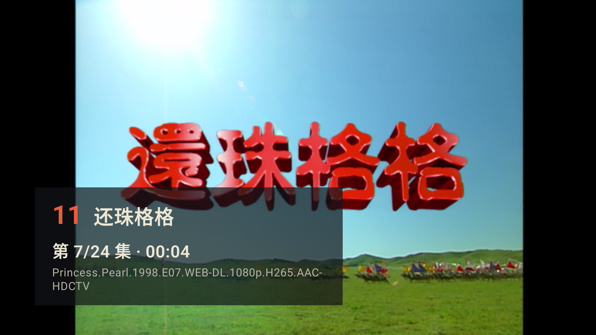
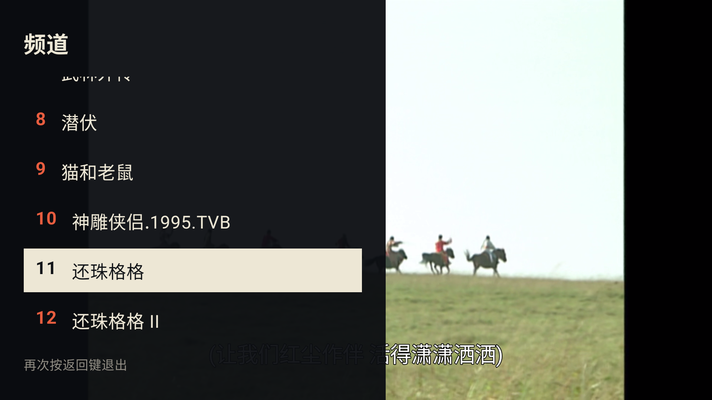

<p align="center">
  
</p>

<h1 align="center">TV2000</h1>

<p align="center"><em>Turn digital videos back into television.</em></p>

TV2000 是一个为 Android TV 设计的本地视频频道播放器。它把 U 盘或 SMB 资源中的一级目录变成频道：打开应用直接续播，按遥控器上下键切台，不必每次从文件管理器里挑选视频。

[下载最新 APK](https://github.com/GoodOldWorks/tv2000/releases/latest/download/TV2000.apk) · [查看 Releases](https://github.com/GoodOldWorks/tv2000/releases) · [校验文件](https://github.com/GoodOldWorks/tv2000/releases/latest/download/TV2000.apk.sha256)

> TV2000 不提供或内置任何影视内容，仅用于播放用户自己的媒体文件。

## 界面

| 播放时的频道信息 | 遥控器频道列表 |
| --- | --- |
|  |  |

## 核心体验

- **目录就是频道**：媒体目录下的每个一级子目录自动成为一个频道。
- **打开即播**：启动后恢复上次频道、集数、位置和播放状态。
- **遥控器优先**：上下切台，左右快退/快进，双击方向键控制剧集。
- **稳定频道号**：刷新索引后尽量保持原有频道编号，不因目录扫描顺序变化而跳号。
- **U 盘与 SMB**：支持本地存储以及 SMB2/SMB3 网络共享的扫描、流式播放和 seek。
- **自然排序**：按照文件名中的数字顺序排列剧集，例如 `Episode 2` 会排在 `Episode 10` 前面。
- **字幕显示**：使用无背景的白色描边字幕，兼顾亮暗画面的可读性。
- **本地索引**：优先读取 Room 快速启动；只读目录快照成功后按卷和 MediaStore 版本复用，随后低频刷新。

## 准备媒体目录

推荐在 U 盘中创建 `TV2000` 目录，每个一级子目录代表一个频道：

```text
TV2000/
├── 猫和老鼠/
│   ├── S01E01.mkv
│   ├── S01E02.mkv
│   └── S01E03.mkv
├── 纪录片/
│   ├── Episode 1.mp4
│   └── Episode 2.mp4
└── 电影/
    └── Movie.m2ts
```

默认优先扫描 U 盘内的 `TV2000`；目录不存在时回退到 U 盘根目录。也可以在资源设置中填写其他相对目录。当前识别 `mp4`、`mkv`、`avi`、`mov`、`ts` 和 `m2ts`。

SMB 资源使用相同的目录规则，地址格式为：

```text
smb://192.168.1.10/共享名/可选目录
```

用户名、密码和域均可留空。当前支持 SMB2/SMB3，不支持 SMB1；同一时间只播放一个 U 盘或 SMB 资源，但切换资源不会删除已有索引和观看进度。

## 遥控器操作

| 按键 | 播放界面 |
| --- | --- |
| 上 / 下 | 切换上一个或下一个频道 |
| 左 / 右 | 快退 10 秒 / 快进 30 秒 |
| 双击右 | 播放下一集 |
| 双击左 | 重新播放当前集；片头 5 秒内双击则播放上一集 |
| OK / 播放暂停 | 播放或暂停，并显示频道信息 |
| 返回 | 打开频道列表；再次返回退出 |
| 菜单 | 打开资源与高级设置 |

在频道列表和菜单中，使用方向键移动高亮，按 OK 确认。

## 安装

从 [Releases](https://github.com/GoodOldWorks/tv2000/releases) 下载 `TV2000.apk`，通过 U 盘安装，或使用 ADB：

```bash
adb install -r TV2000.apk
```

系统要求：Android TV / Google TV 6.0（API 23）或更高版本。首次启动时按照提示选择 U 盘目录，或按菜单键添加 SMB 资源。部分 Android 6 厂商系统不会主动显示存储授权窗口，此时需要在系统的应用权限设置中允许 TV2000 读取存储。

## 本地构建

工程当前使用 Android SDK Platform 37、Build Tools 36.0.0、Gradle 9.5 和 JDK 17。推荐使用 Android Studio 自带 JDK：

```bash
export JAVA_HOME="/Applications/Android Studio.app/Contents/jbr/Contents/Home"

./gradlew testDebugUnitTest
./gradlew lintDebug
./gradlew assembleDebug
```

真机测试：

```bash
./gradlew connectedDebugAndroidTest
```

更多开发资料：

- [产品与技术规格](docs/TV2000-SPEC.md)
- [MVP 开发与测试计划](docs/TV2000-MVP-DEVELOPMENT-TEST-PLAN.md)
- [本地测试指南](docs/TV2000-LOCAL-TESTING.md)

## 许可与名称使用

本项目源代码采用 [Apache License 2.0](LICENSE) 授权，允许使用、修改和分发。分发时须遵守许可证并保留 [NOTICE](NOTICE) 中的原项目归属信息。

Apache License 2.0 不授予原项目名称和品牌的使用权。公开分发修改版本或衍生版本时，必须更换“TV2000”名称及相关品牌标识，不得冒充官方版本，并按 [名称与品牌使用规则](TRADEMARKS.md) 明确说明原项目名称、作者和项目地址。
