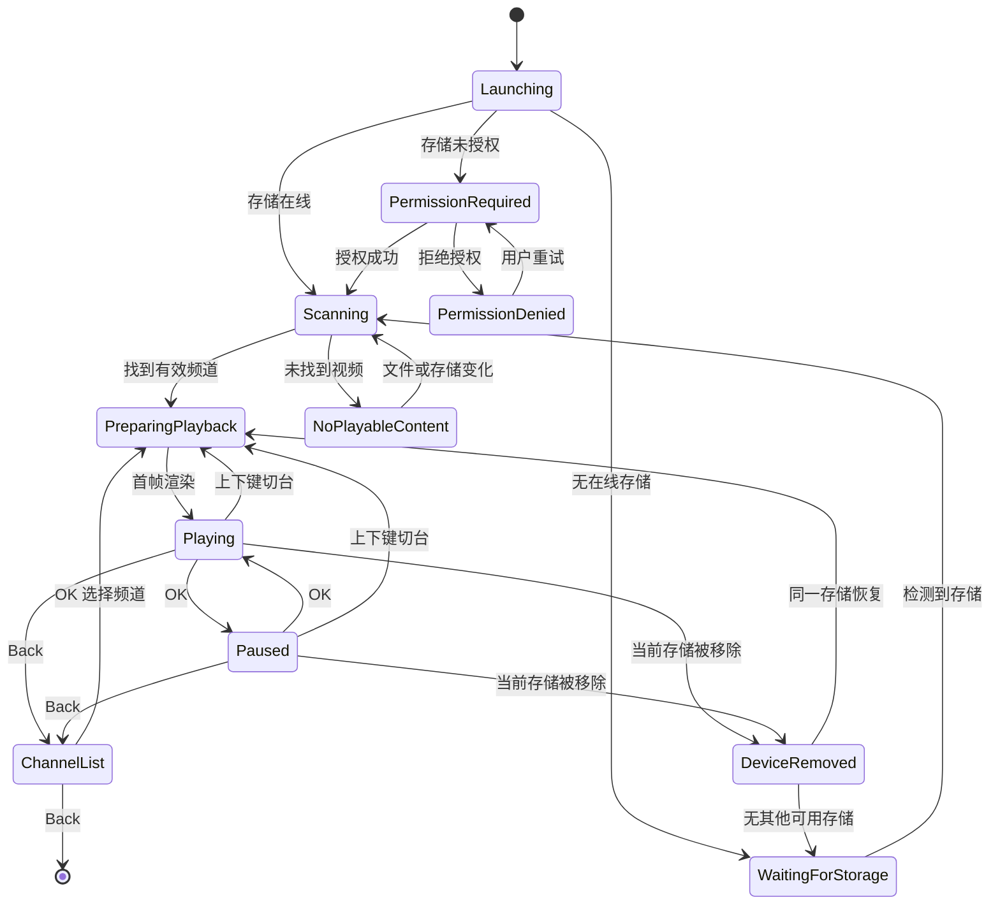

# TV2000 产品与技术规格说明书

> Turn digital videos back into television.

| 项目 | 内容 |
| --- | --- |
| 文档类型 | Product & Engineering Specification |
| 产品名称 | TV2000 |
| 规格版本 | v1.0 |
| 对应 PRD | TV2000 PRD v1.0 |
| 文档状态 | Draft for Implementation |
| 目标平台 | Android TV 6.0+（API 23+） |
| 默认语言 | 简体中文；所有用户可见文案须支持本地化 |

配套文档：[TV2000 MVP 开发与测试计划](./TV2000-MVP-DEVELOPMENT-TEST-PLAN.md)

---

## 1. 文档目的

本文档将 TV2000 PRD 转换为可设计、可开发、可测试、可验收的产品与工程规格。

本文中的规范性关键词含义如下：

- **MUST / 必须**：v1 发布的强制要求。
- **SHOULD / 应当**：默认必须满足，只有存在明确平台限制时才可偏离。
- **MAY / 可以**：可选能力，不影响 v1 核心验收。
- **不得**：明确禁止的行为。

若本文档与 PRD 对同一行为的描述不一致，以本文档中更具体、可测试的条款为实现依据；产品理念与范围仍以 PRD 为最高原则。

---

## 2. 产品定义

TV2000 是一个把本地存储目录自动映射为电视“频道”的全屏播放应用。

它不是文件浏览器、媒体库或点播平台。用户只需要：

1. 插入 U 盘；
2. 打开 TV2000；
3. 使用遥控器上下键切换频道。

文件发现、自然排序、断点续播、下一集播放、字幕与音轨恢复全部由系统自动完成。

### 2.1 核心成功标准

一个从未使用过智能电视文件管理器的用户，应当无需阅读说明书即可完成以下操作：

- 打开应用后看到节目，而不是首页；
- 使用 `↑` / `↓` 切换目录对应的频道；
- 离开频道后再次切回原位置；
- 拔出并重新插入同一 U 盘后继续观看；
- 永远不需要看到文件路径、存储协议或媒体库概念。

### 2.2 体验不变量

以下规则在所有正常播放路径中必须成立：

1. **没有首页**：存在可播放内容时，启动目标始终是首帧播放。
2. **只选择频道**：主界面不得提供单集或文件选择能力。
3. **目录即频道**：一个授权存储根目录下的一级目录对应一个频道。
4. **频道状态独立**：每个频道拥有独立的当前节目、位置、字幕、音轨和播放速度。
5. **隐藏复杂性**：不得向普通用户展示路径、挂载点、协议、解码器或数据库术语。

---

## 3. 范围

### 3.1 v1 包含

- Android TV 9+；
- 本地可移除存储发现与授权；
- 一级目录自动创建频道；
- 频道内视频自动发现与自然排序；
- 启动自动播放；
- 频道独立断点续播；
- 遥控器完整操作；
- 自动下一集；
- 本地外挂及容器内字幕；
- 音轨选择与恢复；
- 隐藏设置；
- U 盘插拔、文件丢失、损坏文件等异常恢复；
- Room 持久化索引和播放历史；
- DataStore 持久化全局设置。

### 3.2 v1 不包含

- 海报墙；
- 文件或单集浏览器；
- 元数据刮削；
- 演员、评分、简介；
- 推荐算法或 AI 推荐；
- 用户账号与登录；
- 在线视频内容；
- 广告；
- SMB、NFS、WebDAV、DLNA；
- Jellyfin、Emby、Plex、Kodi 集成；
- EPG；
- 云同步；
- 用户自定义频道 Logo；
- 家长控制；
- 收藏与随机频道。

### 3.3 平台强制例外

Android 系统可能要求用户首次授予存储访问权限。该系统授权流程是“启动即播放”的唯一允许例外：

- 应用不得创建传统引导页；
- 必须直接发起系统授权流程，并用一句话说明用途；
- 授权成功后必须立即扫描并播放，不得要求再次确认；
- 已授权的存储在后续启动中不得重复询问；
- 权限被拒绝或撤销时，必须显示可恢复的授权提示，不得崩溃或进入空白页。

---

## 4. 术语与数据边界

| 术语 | 定义 |
| --- | --- |
| Storage Volume | 一个可访问的可移除存储卷，例如 U 盘 |
| Storage Root | TV2000 获得授权并用于扫描的存储根目录 |
| Channel | Storage Root 下的一个一级目录 |
| Episode | Channel 扫描范围内的一个可播放视频文件 |
| Channel Cursor | 某频道最后播放的 Episode 与播放位置 |
| Active Channel | 当前正在播放或最近一次播放的频道 |
| Visible Channel | 当前存储在线、目录存在且至少包含一个可播放文件的频道 |
| Natural Sort | 将字符串中的连续数字按数值比较的稳定排序 |
| Overlay | 覆盖在全屏视频上的临时频道或状态信息 |

### 4.1 示例映射

```text
USB_ROOT/
├── 动画/
│   ├── 001.mp4
│   └── 002.mp4
├── 西游记/
│   ├── 第01集.mkv
│   └── 第02集.mkv
└── BBC/
    ├── S01E01.mp4
    └── S01E02.mp4
```

首次扫描后应得到：

```text
频道 1  动画
频道 2  BBC
频道 3  西游记
```

频道显示顺序由第 7 章的稳定编号规则决定，不依赖文件系统返回顺序。

---

## 5. 用户界面规格

### 5.1 界面集合

v1 只允许存在以下用户可见界面：

1. 全屏播放器；
2. 频道切换 Overlay；
3. 频道列表 Overlay；
4. 等待存储状态；
5. 存储授权状态；
6. 设备移除或内容不可播放状态；
7. 隐藏设置；
8. 关于与版本信息。

不得存在启动首页、内容详情页、文件列表页或单集选择页。

### 5.2 全屏播放器

- 视频区域必须占满可用屏幕；
- 默认不得常驻显示播放控制条；
- 默认不得显示文件名、完整路径或技术媒体信息；
- 暂停时可以显示简洁的暂停图标；
- 播放错误不得弹出需要鼠标操作的系统式对话框。

视频缩放默认使用等比适配，保持原始宽高比；黑边允许存在，不得默认裁切内容。

### 5.3 频道切换 Overlay

每次成功切换频道时，Overlay 必须立即显示，并在最后一次按键后 2 秒自动消失。

Overlay 至少包含：

- 频道号；
- 频道名称；
- 当前节目显示名；
- 当前节目在频道中的序号，例如 `第 21/84 集`；
- 已恢复的播放时间，例如 `14:08`。

示例：

```text
2  三国演义
第 21/84 集 · 14:08
```

节目显示名允许使用去除扩展名后的文件名，但不得显示目录路径。

### 5.4 频道列表 Overlay

- 按一次 `Back` 打开频道列表；
- 默认聚焦当前频道；
- `↑` / `↓` 只移动频道焦点，不得在焦点移动时立即播放；
- `OK` 切换到聚焦频道并关闭列表；
- 列表打开时再次按 `Back` 退出应用；
- 10 秒无操作时关闭列表并返回当前播放；
- 列表不得展开或展示频道内文件；
- 同名频道仅在频道列表中追加简短存储名称用于区分，播放 Overlay 仍以频道号为主要区分。

### 5.5 等待存储

未检测到可访问存储时显示：

```text
请插入 U 盘
Waiting for USB…
```

要求：

- 背景为纯黑或品牌静态背景；
- 不显示设置、文件选择或媒体库入口；
- 存储插入后自动进入扫描与播放；
- 等待期间每次存储状态变化均应重新检测；
- 页面不得因屏保之外的普通生命周期切换丢失等待状态。

### 5.6 无可播放内容

检测到存储但没有有效频道时显示：

```text
未找到可播放的视频
请将视频放入 U 盘的一级目录中
```

该状态必须继续监听存储变化，并按设置决定是否自动重扫。

### 5.7 可访问性

- 所有 Overlay 文本应适配电视安全区；
- 默认正文字号不得小于电视观看距离下等效 24sp；
- 文字与背景对比度应满足 WCAG AA；
- 关键状态不能仅依赖颜色表达；
- 焦点必须清晰可见且不会进入不可操作元素；
- 所有核心行为必须仅使用方向键、OK、Back 和 Home 完成。

---

## 6. 应用状态机



### 6.1 状态优先级

当多个事件同时发生时，按以下优先级处理：

1. Activity / 进程销毁前保存播放状态；
2. 当前存储移除；
3. 播放器致命错误；
4. 用户切台；
5. 自动下一集；
6. 后台扫描结果更新。

任意时刻只允许有一个 Active Channel 和一个活动播放器媒体项。

---

## 7. 存储发现与扫描

### 7.1 存储访问抽象

实现必须通过 `StorageProvider` 抽象访问存储，不得把业务逻辑绑定到 `/storage/*/` 的直接文件路径。

`StorageProvider` 至少支持：

- Android 允许直接访问时的文件系统路径；
- Storage Access Framework 持久 URI 授权；
- 系统可移除卷挂载与移除事件；
- 将平台标识转换为稳定的 `volumeId`。

应用必须排除内部模拟存储（通常为 `/storage/emulated`），除非后续版本显式支持。

### 7.2 频道发现

对每个已授权且在线的 Storage Root：

1. 枚举根目录下的一级目录；
2. 忽略隐藏目录、回收站目录和不可读目录；
3. 每个一级目录创建一个候选 Channel；
4. 扫描候选 Channel 内的视频；
5. 只有至少包含一个有效 Episode 的候选 Channel 才成为 Visible Channel。

根目录直接放置的视频在 v1 中忽略。该约束必须通过“无可播放内容”文案向用户说明。

符号链接不得导致跨频道扫描或循环扫描。不可解析的链接必须忽略。

### 7.3 扫描深度

`scanDepth` 表示从 Channel 目录开始向下扫描的最大目录层数：

- 默认值：`1`；
- 允许值：`1...5`；
- `1` 表示只扫描 Channel 目录中的直接文件；
- 大于 `1` 时，子目录内文件仍属于同一个 Channel，不会创建新频道；
- 子目录路径参与 Episode 排序，但不向普通播放界面显示完整路径。

### 7.4 支持的扩展名

v1 必须不区分大小写地识别：

```text
.mp4 .mkv .avi .mov .ts .m2ts .webm
```

零字节文件、不可读文件和目录必须忽略。扩展名命中只表示进入播放候选集，不表示设备一定具备对应编解码能力。

### 7.5 扫描算法要求

扫描器必须：

- 可取消；
- 幂等；
- 不阻塞主线程；
- 对同一存储的并发扫描去重；
- 将一次扫描结果作为原子快照提交；
- 对未变化文件复用已有元数据；
- 先发现频道和首个可播放项，再继续完成其余索引；
- 在插入、重新挂载、应用启动和手动重扫时触发；
- 在 `autoRescan=true` 时响应可用的文件系统或媒体库变化事件。

应用后续启动时必须优先使用上次索引恢复播放，并在后台校验文件是否仍存在。不得为了完整重扫而无条件阻塞首帧。

系统自动挂载的可移除卷应先执行一次只读目录快照；有缓存时先恢复播放，再在后台完成该快照。
目录快照成功完成后作为权威结果原子提交，并按卷、媒体目录和 MediaStore generation/version 保存
校验标记；卷保持挂载且版本未变化时，应用重启也不得重复遍历文件树，检测到卷重新挂载则必须使
标记失效。目录快照暂时失败时允许按退避策略做有限次数重试，成功后必须立即停止重试。目录快照与
MediaStore 查询不得并发执行，避免在慢盘上叠加随机读取。

Android 在刚挂载时可能只返回尚未完成的媒体库结果，因此后续 MediaStore 结果必须按渐进快照处理：
新频道和 Episode 可以立即合并显示，但不得用较小的临时结果隐藏上一份有效索引。应用应依据
MediaStore generation/version 退避观察；版本未变化时不得重复查询和写入 Room。收到系统媒体扫描
完成事件或用户明确执行“重建索引”后，才可将 MediaStore 结果作为可移除缺失项目的权威快照。

文件路径或 SAF 回退扫描只读取目录项和文件属性，不读取视频正文，不提取时长、缩略图或媒体头。
同一轮扫描中每个候选文件的类型、大小和修改时间应合并为单次属性读取，避免在慢盘上重复随机访问。
直接路径可读时，Episode 应优先保存稳定文件 URI；不得让 MediaStore 重建产生的临时行 ID 覆盖
仍然有效的直接路径。

### 7.6 文件变更规则

| 变更 | 规定行为 |
| --- | --- |
| 新增频道目录 | 分配新频道号并加入可见频道 |
| 删除频道目录 | 标记离线，不立即删除历史 |
| 新增 Episode | 下一次快照提交后加入自然排序 |
| 删除非当前 Episode | 从索引移除，其他历史保持 |
| 删除当前 Episode | 按第 12.3 节选择替代项 |
| 文件重命名 | v1 可视为旧 Episode 删除、新 Episode 新增 |
| 文件内容更新 | 保留路径标识；若大小或修改时间变化，刷新元数据 |

---

## 8. 频道与编号

### 8.1 稳定标识

频道主键必须与显示名称、列表位置解耦。

建议：

```text
channelId = SHA-256(volumeId + normalizedRelativeDirectoryPath)
episodeId = SHA-256(channelId + normalizedRelativeFilePath)
```

要求：

- 同一 U 盘重新插入后能够匹配原频道；
- 频道重命名在 v1 可被视为新频道；
- 播放历史不得仅以频道号作为主键。

### 8.2 频道名称

- 默认使用一级目录名称；
- 保留 Unicode 字符；
- 去除首尾空白；
- 空名称回退为本地化的 `未命名频道`；
- 普通界面不得显示路径；
- 两个在线频道重名时，频道号必须保持唯一，列表中可追加存储短名称。

### 8.3 频道编号

首次发现一组频道时：

1. 按存储首次发现顺序分组；
2. 每个存储内按频道名称自然排序；
3. 从 `1` 开始分配频道号。

后续扫描：

- 已知 `channelId` 保留原频道号；
- 新频道使用当前最大频道号加一；
- 暂时离线的频道号保留，不分配给其他频道；
- 重置应用数据后可以重新编号；
- `↑` / `↓` 仅在当前 Visible Channel 中按频道号循环切换；
- 频道号允许暂时不连续。

数据库可保留离线频道记录。默认不得自动清除历史；用户清除应用数据视为显式重置。

### 8.4 单盘换碟行为

当前版本采用“单一当前盘”的换碟模式：

- 当前 U 盘拔出后，立即捕获并保存播放位置、停止声音并释放当前媒体；
- 等待画面显示“请插入原 U 盘或另一张影片盘”；
- 只检测到一个已挂载 U 盘时，无需确认，自动切换并恢复该盘自己的频道、节目和进度；
- 已认识的盘重新出现时保留原频道号、最后频道和各频道观看历史；
- 新盘中的新频道从数据库历史最大频道号继续分配，离线盘留下的号码不回收；
- 同时检测到多个盘且当前盘不在线时，本版本不自动选择，多个盘的极简选择列表留待后续实现。

盘身份优先使用规范化的文件系统 UUID / MediaStore volume name。卷标、容量、品牌和设备规格
均不参与身份判断，因此同名卷标绝不合并；重新格式化导致 UUID 改变时默认视为新盘。访问 URI
和临时挂载路径可以更新，但不得改变同一 UUID 对应的数据库身份。若厂商完全不暴露 UUID，才
降级使用系统访问 URI，此时必须保持不同 URI 互不合并。

应用不得为了识别盘而向 U 盘写入隐藏文件、数据库或其他标记；用户媒体始终只读。

---

## 9. Episode 发现与自然排序

### 9.1 排序目标

以下文件必须按人类期望排序：

```text
1.mp4
2.mp4
10.mp4
11.mp4
```

同时必须支持：

```text
01 / 02 / 03
S01E01 / S01E02 / S01E10
第01集 / 第02集 / 第10集
```

### 9.2 规范算法

对参与排序的相对路径执行：

1. Unicode NFKC 规范化；
2. 按路径段逐段比较；
3. 将连续十进制数字切分为数字 token；
4. 数字 token 使用任意精度整数值比较；
5. 数值相同时，位数较短者优先；
6. 非数字 token 使用大小写不敏感的稳定比较；
7. 比较结果相同时，使用原始规范化相对路径进行二次比较；
8. 仍相同时使用 `episodeId` 保证完全稳定。

禁止直接使用普通字典序作为最终 Episode 顺序。

### 9.3 显示名称

Episode 显示名称默认：

1. 取文件名最后一段；
2. 去掉扩展名；
3. 不修改其余文本。

显示名称仅用于 Overlay，不得形成可浏览或可点选的节目列表。

---

## 10. 启动与自动恢复

### 10.1 启动决策

启动时按以下顺序执行：

1. 初始化最小播放依赖；
2. 读取全局设置和上次 Active Channel；
3. 检测已授权的在线存储；
4. 从 Room 读取缓存频道索引；
5. 若上次 Active Channel 在线且 Episode 存在，则恢复；
6. 否则播放频道号最小的 Visible Channel；
7. 若无缓存但存在存储，则优先扫描第一个候选频道并播放；
8. 后台完成全部扫描和缓存校验。

全流程不得出现需要用户点击的首页或确认页。

### 10.2 第一次安装

首次安装且授权成功后：

- 选择频道号最小的 Visible Channel；
- 选择其排序第一的 Episode；
- 从 `00:00` 播放；
- 立即创建 Channel Cursor；
- 不弹出“是否继续”“选择播放器”等对话框。

### 10.3 后续启动

若上次状态为：

```text
频道：西游记
Episode：第18集
Position：23:41
```

则必须直接准备该媒体项，并 seek 到保存位置。允许在 seek 完成前显示最后帧、黑屏或简洁加载状态，但不得进入其他界面。

### 10.4 进程异常终止

应用崩溃或被系统回收后，下次启动必须使用最近一次周期性保存的位置恢复。正常播放时历史保存间隔不得超过 5 秒。

---

## 11. 播放行为

### 11.1 播放器

v1 使用 AndroidX Media3 ExoPlayer。播放器必须：

- 使用单一播放器实例完成同一会话内的切台；
- 优先启用设备硬件解码；
- 在不支持硬件解码时按 Media3 能力安全回退；
- 正确处理音频焦点；
- Home 离开应用时暂停并保存；
- 应用重新回到前台时恢复到离开前的播放/暂停状态；
- 不在后台持续播放视频或声音。

### 11.2 断点续播

每个 Channel Cursor 至少记录：

- 当前 `episodeId`；
- `positionMs`；
- 是否已完成；
- 字幕偏好；
- 音轨偏好；
- 播放速度。

保存触发点：

- 播放中每 5 秒；
- 暂停；
- 切换频道；
- 切换 Episode；
- Activity 进入后台；
- 当前存储移除；
- 播放完成；
- 正常退出。

位置恢复规则：

- 保存位置 `< 5 秒` 时从 `00:00` 开始；
- 已完成 Episode 按第 11.4 节处理；
- seek 到保存位置后的误差应不超过 1 秒，受容器关键帧限制时允许使用最接近的安全关键帧；
- 保存位置超过新文件时长时视为已完成。

### 11.3 完成判定

满足任一条件时标记 Episode 完成：

- 收到播放器 `ENDED`；
- 已观看至少 90%，且剩余时长不超过 30 秒时离开该 Episode；
- 保存位置不小于媒体时长。

纯播放错误不得标记为已完成。

### 11.4 自动下一集

默认设置：

```text
autoPlayNext = true
loopChannel = false
```

行为：

- 当前 Episode 正常完成且存在下一集：立即播放下一集；
- `autoPlayNext=false`：停在当前 Episode 结束状态，按 `OK` 从头重播；
- 最后一集结束且 `loopChannel=false`：停止播放并显示 `本频道节目已播放完毕`；
- 最后一集结束且 `loopChannel=true`：从第一集 `00:00` 开始；
- 自动下一集不得显示文件选择；
- 自动下一集必须继承该频道的字幕、音轨与播放速度偏好。

频道中已完成的旧 Episode 不会被自动跳过；“下一集”严格指自然排序后的下一个 Episode。这样可确保循环与用户主动切回时行为可预测。

### 11.5 Seek

- 快退默认 10 秒；
- 快进默认 30 秒；
- 可配置范围为 `5...300` 秒；
- seek 结果必须限制在 `[0, duration]`；
- 长按左右键 MAY 连续触发 seek；
- 连续触发时应合并请求，避免播放器队列堆积；
- seek Overlay 可短暂显示目标时间，但不得展开完整控制栏。

### 11.6 字幕

v1 必须支持 Media3 和设备实际可解码的：

- SRT；
- ASS；
- SSA；
- 容器内文本字幕。

外挂字幕匹配规则：

1. 与视频文件位于同一目录；
2. 基础文件名相同，或基础文件名后追加语言/标签；
3. 示例：`E01.mkv` 可匹配 `E01.srt`、`E01.zh.srt`、`E01.en.ass`；
4. 多字幕时优先使用该频道保存的语言与标签偏好；
5. 无匹配偏好时使用设置中的全局默认；
6. 仍无法确定时遵循播放器默认选择。

PGS 列入后续能力；若容器和设备已经支持，可以播放，但不作为 v1 强制验收项。

### 11.7 音轨

音轨偏好必须使用语言、角色标记、标签等稳定描述保存，不得仅保存易变化的轨道数组下标。

切换 Episode 时：

1. 优先匹配频道历史偏好；
2. 匹配不到时使用全局偏好；
3. 再回退到容器默认轨道；
4. 回退不得阻止播放。

### 11.8 播放速度

- 默认 `1.0x`；
- 可设置范围 `0.5x...2.0x`；
- 步进 `0.05x` 或由设置 UI 提供的离散值；
- 每频道独立保存；
- 新频道初始使用全局默认值。

---

## 12. 频道切换

### 12.1 直接切台

在全屏播放或暂停状态按 `↑` / `↓`：

1. 立即记录当前 Channel Cursor；
2. 停止当前媒体项的渲染与音频；
3. 选择上一或下一 Visible Channel；
4. 读取目标频道历史；
5. 准备目标 Episode 并 seek；
6. 显示 2 秒频道 Overlay；
7. 目标频道按其历史播放状态开始播放。

`↑` 定义为前一个较小频道号，`↓` 定义为后一个较大频道号。到达两端时循环。

若只有一个 Visible Channel，`↑` / `↓` 只刷新 Overlay，不重新创建播放会话。

### 12.2 快速连续切台

用户快速多次按 `↑` / `↓` 时：

- 每次按键必须立即更新目标频道号与 Overlay；
- 尚未完成的上一目标频道准备任务必须取消；
- 只允许最终目标频道进入播放；
- 不得出现多个频道音频重叠；
- 不得把未实际播放的中间频道写成 Active Channel。

### 12.3 目标 Episode 丢失

恢复目标频道时，如果历史 Episode 不存在：

1. 选择原排序位置之后的第一个有效 Episode；
2. 若不存在，选择频道第一集；
3. 从 `00:00` 播放；
4. 更新 Channel Cursor；
5. 不弹出文件错误对话框。

若频道已无任何有效 Episode，将其从 Visible Channel 移除并继续选择相邻可见频道；如果没有其他频道，进入“无可播放内容”状态。

---

## 13. 遥控器映射

### 13.1 播放状态

| 按键 | 短按行为 | 快速双击行为 | 长按行为 |
| --- | --- | --- | --- |
| `↑` | 上一个频道 | 与短按相同 | MAY 连续切台 |
| `↓` | 下一个频道 | 与短按相同 | MAY 连续切台 |
| `←` | 快退，默认 10 秒 | 当前位置大于 5 秒时回到本集 `00:00`；当前位置不超过 5 秒时从 `00:00` 播放上一集 | 连续快退 |
| `→` | 快进，默认 30 秒 | 从 `00:00` 播放下一集 | 连续快进 |
| `Previous` | 从 `00:00` 播放上一集 | 与短按相同 | 与短按相同 |
| `Next` | 从 `00:00` 播放下一集 | 与短按相同 | 与短按相同 |
| `OK` / `Enter` | 暂停或继续 | 与短按相同 | 与短按相同 |
| `Back` | 打开频道列表 | 与短按相同 | 与短按相同 |
| `Home` | 交还系统处理，保存并暂停 | 与短按相同 | 系统处理 |
| `Menu` | 单次无用户可见效果 | 与短按相同 | 计入隐藏设置序列 |

左右键双击判定窗口为 350ms。为避免把双击误识别为 seek，左右键单击操作在判定窗口结束后执行。双击换集不得改变当前暂停/播放状态；到达首集或末集时保持当前 Episode，并显示边界提示。

### 13.2 频道列表状态

| 按键 | 行为 |
| --- | --- |
| `↑` / `↓` | 移动频道焦点 |
| `OK` | 切换到焦点频道 |
| `Back` | 退出应用 |
| `←` / `→` | 翻页；不足一页时无操作 |

### 13.3 数字键

数字键直达频道为 v1 可选项：

- 若实现，输入超时为 1.5 秒；
- 输入期间显示数字 Overlay；
- 存在该 Visible Channel 时直接切换；
- 频道离线或不存在时保留当前频道并显示 `频道不可用`；
- 未实现时不得让数字键影响播放状态。

### 13.4 隐藏设置入口

默认入口：

- 3 秒内连续按 `Menu` 5 次；
- 成功后打开隐藏设置；
- 计数超时或按下其他键时重置；
- 单次 `Menu` 不显示提示，避免普通用户误入。

没有 `Menu` 键的设备必须提供兜底入口：在“等待 U 盘”或“无可播放内容”状态长按 `OK` 5 秒。该入口不得在正常播放中与暂停操作冲突。

---

## 14. 隐藏设置

### 14.1 设置项与默认值

| 设置项 | Key | 默认值 | 可选范围 |
| --- | --- | --- | --- |
| 自动下一集 | `autoPlayNext` | `true` | 开 / 关 |
| 频道循环 | `loopChannel` | `false` | 开 / 关 |
| U 盘自动重扫 | `autoRescan` | `true` | 开 / 关 |
| 扫描深度 | `scanDepth` | `1` | 1...5 |
| 快进秒数 | `seekForwardSeconds` | `30` | 5...300 |
| 快退秒数 | `seekBackwardSeconds` | `10` | 5...300 |
| 默认播放速度 | `defaultPlaybackSpeed` | `1.0` | 0.5...2.0 |
| 默认字幕 | `subtitlePreference` | 自动 | 自动 / 关闭 / 语言 |
| 默认音轨 | `audioPreference` | 自动 | 自动 / 可用语言 |
| 检查更新 | — | 手动动作 | 由分发渠道决定 |
| 关于 | — | 手动动作 | 版本、许可、设备能力 |

### 14.2 设置行为

- 设置使用 DataStore 持久化；
- 更改 seek 秒数立即生效；
- 更改播放速度默认值只影响没有频道级偏好的频道；
- 更改扫描深度必须触发全量重扫；
- 关闭自动重扫不影响插入、移除和应用启动时的必要扫描；
- 设置界面退出后返回进入前的频道和播放位置；
- 设置界面中播放必须暂停；
- 设置界面不得提供文件选择。

### 14.3 更新

v1 的“检查更新”只负责调用实际分发渠道提供的更新能力。若构建渠道不支持应用内更新：

- 隐藏该项，或
- 显示当前版本并提示通过原安装渠道更新。

不得为更新能力引入账号系统、广告或内容推荐。

---

## 15. 异常与恢复

### 15.1 当前存储被移除

检测到当前存储移除时必须：

1. 在播放器仍持有当前位置时立即捕获并保存位置；
2. 暂停并释放对该媒体文件的读取；
3. 停止声音；
4. 显示：

```text
请插入原 U 盘或另一张影片盘
```

只检测到一个 `volumeId` 后：

1. 自动校验历史 Episode；
2. 必要时重扫；
3. 恢复该盘自己的最后频道、Episode、位置和播放状态；
4. 不要求确认。

### 15.2 非当前存储被移除

同时挂载多个 U 盘的选择和在线集合管理不在当前版本范围内。若当前盘仍在线，其他盘的挂载
变化不得中断播放；若当前盘不在线且检测到多个候选盘，本版本保持等待状态且不任意选择。

### 15.3 播放文件损坏或格式不支持

播放器发生不可恢复错误时：

1. 记录本地诊断信息；
2. 将该 Episode 标记为本次会话不可播放；
3. 显示不超过 2 秒的 `无法播放，正在尝试下一集`；
4. 尝试自然排序中的下一 Episode；
5. 同一 Episode 在一次会话中最多自动重试一次；
6. 若频道内所有 Episode 均失败，显示 `此频道没有可播放的节目`；
7. 不得形成无限跳转或错误重试循环。

播放错误不得清除已有历史，也不得将失败文件标记为已完成。

### 15.4 权限丢失

- 进入可恢复的授权状态；
- 显示 `需要存储访问权限才能播放 U 盘视频`；
- 用户选择重试时重新发起系统授权；
- 不得引导用户进入文件管理器选择单个视频；
- 其他仍有权限的存储可以继续工作。

### 15.5 数据库损坏

- 首选 Room migration 和完整性校验；
- 无法恢复索引时可以重建媒体索引；
- 播放历史应与可重建索引分离或在重建前尽量导出恢复；
- 不得因单个损坏记录阻止应用启动；
- 只有确认历史库不可恢复时才允许清空历史，并记录诊断原因。

### 15.6 存储空间不足

- 索引写入失败不得导致当前播放停止；
- 显示简短的 `无法保存观看进度`；
- 后续保存时继续重试；
- 不得向 U 盘写入任何媒体或索引文件。

---

## 16. 媒体兼容性

### 16.1 容器

v1 扫描并尝试播放：

- MP4；
- MKV；
- AVI；
- MOV；
- TS；
- M2TS；
- WEBM。

### 16.2 编解码能力

目标能力包括：

- H.264；
- H.265 / HEVC；
- AV1；
- HDR；
- Dolby Vision（设备与系统支持时）。

兼容性定义：

- TV2000 必须正确调用 Media3 和设备公开的解码能力；
- 不保证每台 Android TV 对所有容器、编码档位、分辨率和音频编码都可播放；
- 不支持的媒体必须按第 15.3 节安全跳过；
- HDR 与 Dolby Vision 必须在显示设备、系统、解码器和链路均支持时保持对应输出；
- 不支持时不得错误宣称已启用 HDR 或 Dolby Vision；
- Dolby Vision 的正式发布支持范围须由设备兼容矩阵验证。

---

## 17. 数据模型

### 17.1 Room 表

#### `storage_volume`

| 字段 | 类型 | 约束 / 含义 |
| --- | --- | --- |
| `volume_id` | TEXT | 主键，稳定卷标识 |
| `display_name` | TEXT | 用户可读短名称 |
| `root_uri` | TEXT | 持久授权 URI 或抽象位置 |
| `permission_persisted` | BOOLEAN | 是否有持久权限 |
| `is_online` | BOOLEAN | 当前是否在线 |
| `first_seen_at` | INTEGER | epoch ms |
| `last_seen_at` | INTEGER | epoch ms |

#### `channel`

| 字段 | 类型 | 约束 / 含义 |
| --- | --- | --- |
| `channel_id` | TEXT | 主键 |
| `volume_id` | TEXT | 外键 |
| `relative_path` | TEXT | 存储内相对目录 |
| `display_name` | TEXT | 频道名称 |
| `channel_number` | INTEGER | 唯一、稳定 |
| `is_visible` | BOOLEAN | 当前是否在线且有内容 |
| `last_scanned_at` | INTEGER | epoch ms |
| `created_at` | INTEGER | epoch ms |

索引：

- 唯一索引：`channel_number`；
- 唯一索引：`volume_id + relative_path`；
- 普通索引：`is_visible + channel_number`。

#### `episode`

| 字段 | 类型 | 约束 / 含义 |
| --- | --- | --- |
| `episode_id` | TEXT | 主键 |
| `channel_id` | TEXT | 外键 |
| `relative_path` | TEXT | Channel 内相对文件路径 |
| `display_name` | TEXT | 去扩展名文件名 |
| `media_uri` | TEXT | StorageProvider 可解析位置 |
| `size_bytes` | INTEGER | 文件大小 |
| `modified_at` | INTEGER | 修改时间 |
| `duration_ms` | INTEGER? | 可延迟读取 |
| `sort_key` | BLOB/TEXT | 可持久化自然排序 token |
| `scan_generation` | INTEGER | 原子快照代号 |
| `is_available` | BOOLEAN | 当前快照可用性 |

索引：

- 唯一索引：`channel_id + relative_path`；
- 普通索引：`channel_id + is_available`。

#### `channel_playback_state`

| 字段 | 类型 | 约束 / 含义 |
| --- | --- | --- |
| `channel_id` | TEXT | 主键、外键 |
| `episode_id` | TEXT? | 当前 Episode |
| `position_ms` | INTEGER | 非负 |
| `episode_completed` | BOOLEAN | 当前 Episode 完成状态 |
| `subtitle_pref_json` | TEXT? | 稳定字幕描述 |
| `audio_pref_json` | TEXT? | 稳定音轨描述 |
| `playback_speed` | REAL | 0.5...2.0 |
| `was_playing` | BOOLEAN | 离开时播放状态 |
| `updated_at` | INTEGER | epoch ms |

#### `episode_playback`

| 字段 | 类型 | 约束 / 含义 |
| --- | --- | --- |
| `episode_id` | TEXT | 主键、外键 |
| `last_position_ms` | INTEGER | 最近位置 |
| `completed` | BOOLEAN | 是否完成 |
| `last_played_at` | INTEGER | epoch ms |

#### `app_state`

| 字段 | 类型 | 约束 / 含义 |
| --- | --- | --- |
| `singleton_id` | INTEGER | 固定为 1 |
| `active_channel_id` | TEXT? | 最近实际播放频道 |
| `schema_version` | INTEGER | 应用状态版本 |
| `updated_at` | INTEGER | epoch ms |

### 17.2 事务要求

以下操作必须在单一 Room 事务中完成：

- 提交一次频道扫描快照；
- 保存当前 Channel Cursor 并更新 Active Channel；
- Episode 完成并移动到下一 Episode；
- 删除不可用索引引用时修正 Channel Cursor。

数据库不得存储视频内容、字幕内容或缩略图。

### 17.3 DataStore

DataStore 只保存第 14 章的全局设置、少量 UI 偏好和可丢弃的资源刷新标记。频道历史与媒体索引不得拆散存入多个无事务保证的 Preferences key。

---

## 18. 组件设计

| 组件 | 责任 |
| --- | --- |
| `StorageMonitor` | 监听卷挂载、移除与权限状态 |
| `StorageProvider` | 抽象文件系统、SAF URI 与目录枚举 |
| `MediaScanner` | 频道发现、Episode 过滤、自然排序与快照 |
| `ChannelRepository` | 频道编号、可见性、相邻频道查询 |
| `PlaybackStateRepository` | Channel Cursor 与完成历史 |
| `SettingsRepository` | DataStore 设置 |
| `PlaybackCoordinator` | 启动恢复、切台、自动下一集、错误跳过 |
| `PlayerController` | Media3 生命周期、seek、轨道与速度 |
| `RemoteInputRouter` | 按键状态映射、连按与长按 |
| `OverlayController` | 频道信息、错误与超时显示 |
| `Diagnostics` | 本地结构化日志和性能采样 |

### 18.1 单向事件流

```text
Storage / Remote / Player Event
              ↓
      PlaybackCoordinator
       ↙       ↓        ↘
Repository  Player   Overlay
       ↘       ↓        ↙
          UI State
```

UI 不得直接修改 Room 或调用 StorageProvider。所有播放状态变更必须由 `PlaybackCoordinator` 串行化。

### 18.2 并发规则

- 播放控制事件在单一顺序队列中处理；
- 扫描在 IO dispatcher 中执行；
- Room 访问不得运行在主线程；
- 新切台事件必须能够取消旧的 prepare/seek；
- 扫描结果不能覆盖比其更新的扫描 generation；
- 存储移除事件必须能抢占扫描和播放器准备；
- Overlay 计时使用可取消任务，新的 Overlay 事件重置 2 秒计时。

---

## 19. 非功能要求

### 19.1 性能

| 指标 | 目标 | 测量起点 | 测量终点 |
| --- | --- | --- | --- |
| 冷启动恢复 | ≤ 2 秒 | Activity 创建 | 视频首帧 |
| 频道切换 | ≤ 500 ms | 有效按键事件 | 目标频道首帧 |
| 历史 seek 恢复 | ≤ 300 ms | 媒体已可 seek | 恢复位置首帧 |
| 1000 Episode 扫描 | < 1 秒 | 开始枚举 | Room 快照提交 |
| 稳态内存 | < 150 MB PSS | 连续播放 10 分钟后 | 采样窗口峰值 |

测量前提：

- 参考硬件和参考 U 盘型号在发布测试计划中固定；
- 存储已挂载且权限已授予；
- 使用本地、未损坏、设备原生支持的 1080p H.264 测试视频；
- 冷启动恢复使用已有有效索引；
- 首次扫描允许渐进式完成，但首个频道发现不得等待全部媒体元数据解析；
- 挂载时间、系统授权交互和电视从休眠唤醒不计入应用内部指标；
- 所有指标按至少 30 次测试的 P95 验收，扫描指标同时记录中位数和 P95。

若慢速 U 盘无法达到扫描目标，首帧目标仍必须通过缓存索引和渐进扫描优先保证。

### 19.2 稳定性

- 连续播放 24 小时不得因应用内存泄漏崩溃；
- 连续切台 500 次不得出现音频重叠、失去遥控器焦点或不可恢复黑屏；
- U 盘插拔 100 次不得损坏数据库；
- 扫描任务被中止时，上一个完整索引快照必须仍可使用；
- MediaStore 尚未完成时的较小快照不得隐藏已有频道或 Episode；
- 自动挂载扫描不得与系统 MediaStore 索引并行遍历整个 U 盘文件树；
- 播放历史写入必须承受进程在任意写入点终止。

### 19.3 启动与包体

- 首帧之前不得初始化非核心网络 SDK、广告 SDK 或大型图片库；
- 不生成海报、缩略图或波形；
- v1 不需要后台常驻服务；
- 应用进程在退出后不得持续扫描。

### 19.4 离线与隐私

- 核心播放功能必须完全离线工作；
- 不要求账号；
- 不上传文件名、路径、观看历史或设备内容；
- v1 默认不包含第三方分析 SDK；
- 诊断日志保存在本地，并对绝对路径做脱敏；
- 检查更新是唯一允许的可选网络能力，由构建渠道控制。

### 19.5 安全

- 只申请完成存储读取和播放所需的最小权限；
- 不向可移除存储写入任何文件；
- 持久 URI 权限仅限用户授权范围；
- 外部字幕按不可信输入处理；
- 文件名和媒体元数据不得直接作为 HTML 或命令执行；
- 日志不得记录完整 SAF 授权 token 或用户完整路径。

---

## 20. 诊断与日志

v1 应提供仅本地可用的结构化诊断事件：

- `app_launch_started`
- `storage_detected`
- `storage_removed`
- `scan_started`
- `scan_completed`
- `scan_failed`
- `channel_tune_requested`
- `channel_first_frame`
- `resume_seek_completed`
- `playback_error`
- `history_save_failed`

每条事件应包含：

- 单调时钟时间；
- 应用版本；
- 会话 ID；
- 脱敏后的 volume/channel/episode 哈希；
- 耗时；
- 错误分类；
- 不包含原始文件名和完整路径。

发布构建必须限制日志大小并滚动清理。

---

## 21. 验收标准

### AC-001 首次启动自动播放

**Given** 已插入并授权一个 U 盘，存在两个有效频道
**When** 首次启动 TV2000
**Then** 应自动播放频道号最小频道的第一集，且不出现首页或文件列表

### AC-002 后续启动恢复

**Given** 上次退出时正在播放“西游记”第 18 集 `23:41`
**When** 再次启动应用
**Then** 应直接播放同一频道、同一集，并在 `23:41 ± 1 秒` 恢复

### AC-003 频道历史独立

**Given** 频道 A 位于第 17 集 `23:18`，频道 B 位于第 41 集 `02:31`
**When** 在 A、B 之间反复切换
**Then** 每次均恢复各自 Episode、位置、字幕、音轨和速度

### AC-004 直接切台

**Given** 至少存在三个 Visible Channel
**When** 播放中按一次 `↓`
**Then** 当前音频立即停止，目标频道恢复，Overlay 显示 2 秒，并在 500ms 目标内渲染首帧

### AC-005 快速连续切台

**Given** 存在五个频道
**When** 在 500ms 内连续按 `↓` 三次
**Then** 最终只播放目标第三个频道，不播放中间频道音频，不写入中间频道为 Active Channel

### AC-006 自然排序

**Given** 一个频道包含 `1.mp4`、`10.mp4`、`2.mp4`、`第03集.mp4`
**When** 扫描并连续播放
**Then** 数字部分按数值而非字典序排序，并在相同命名系列内保持稳定结果

### AC-007 自动下一集

**Given** `autoPlayNext=true` 且当前 Episode 不是最后一集
**When** 播放结束
**Then** 当前 Episode 标记完成，并直接从 `00:00` 播放自然排序后的下一集

### AC-008 最后一集结束

**Given** 当前为最后一集且 `loopChannel=false`
**When** 播放结束
**Then** 停止并显示 `本频道节目已播放完毕`，不得打开文件选择器

### AC-009 频道循环

**Given** 当前为最后一集且 `loopChannel=true`
**When** 播放结束
**Then** 从该频道第一集 `00:00` 开始播放

### AC-010 没有 U 盘

**Given** 没有可访问存储
**When** 启动应用
**Then** 显示等待 U 盘状态
**And When** 插入已授权 U 盘
**Then** 自动扫描并播放，无需确认

### AC-011 播放中拔出 U 盘

**Given** 正在播放 U 盘内容
**When** 拔出当前 U 盘
**Then** 声音停止并显示设备移除
**And When** 重新插入同一 U 盘
**Then** 从最近保存位置自动恢复

### AC-012 当前文件丢失

**Given** 历史 Episode 已被删除
**When** 启动或切回该频道
**Then** 选择原位置之后的有效 Episode；不存在时选择第一集

### AC-013 损坏文件

**Given** 当前 Episode 无法解码且后续存在有效 Episode
**When** 播放失败
**Then** 简短提示后尝试下一集，同一失败项不会无限重试

### AC-014 频道列表

**Given** 正在播放
**When** 按一次 `Back`
**Then** 显示只包含频道的列表
**And When** 再按一次 `Back`
**Then** 保存状态并退出应用

### AC-015 隐藏设置

**Given** 正在播放且遥控器具有 `Menu` 键
**When** 3 秒内连续按 `Menu` 5 次
**Then** 暂停播放并打开设置；普通单次按键不显示设置入口

### AC-016 单盘换碟

**Given** A 盘正在播放且 B 盘包含自己的观看历史
**When** 拔出 A 盘并只插入 B 盘
**Then** 立即停止 A 盘声音，并自动恢复 B 盘自己的最后频道和位置
**And When** 再换回 A 盘
**Then** A 盘原频道号和观看历史保持不变
**And When** 插入重新格式化或从未认识的盘
**Then** 视为新盘，新频道从数据库历史最大频道号继续分配

### AC-017 根目录文件

**Given** U 盘根目录只有视频、没有一级目录
**When** 扫描
**Then** 显示“请将视频放入 U 盘的一级目录中”，不得把文件逐个创建为频道

### AC-018 权限撤销

**Given** 存储权限已被系统撤销
**When** 启动应用
**Then** 显示简洁授权提示，可重新授权，且不得崩溃或进入文件浏览器

### AC-019 Home 行为

**Given** 正在播放
**When** 按 `Home`
**Then** 立即保存、暂停并返回系统
**And When** 返回 TV2000
**Then** 恢复原播放/暂停状态和位置

### AC-020 无文件选择能力

**Given** 任意普通用户路径
**When** 遍历所有可聚焦控件与遥控器按键
**Then** 不存在打开文件管理器、浏览 Episode 或选择单个视频的入口

---

## 22. 测试矩阵

### 22.1 Android 版本

- Android TV 6.0 / API 23，覆盖厂商旧版 U 盘挂载与运行时权限实现；
- Android TV 9 / API 28；
- Android TV 10；
- Android TV 11；
- Android TV 12；
- Android TV 13+ 的发布目标版本。

### 22.2 存储

- FAT32；
- exFAT；
- NTFS（仅设备系统支持时）；
- U 盘启动前已插入；
- 应用运行中插入；
- 播放中移除；
- 同一 U 盘重新插入；
- 两个 U 盘同时在线；
- 只读存储；
- 1000 个 Episode；
- 深层目录达到 `scanDepth` 边界；
- Unicode、中文、空格和超长文件名。

### 22.3 媒体

- 每个声明容器至少一个样本；
- H.264、H.265、AV1；
- SDR、HDR10、设备支持时 Dolby Vision；
- 单音轨和多音轨；
- 无字幕、单字幕、多字幕；
- SRT、ASS、SSA；
- 时长未知的流式容器；
- 损坏文件；
- 零字节文件；
- 扩展名正确但内容错误；
- 超短视频；
- 保存位置超过新媒体时长。

### 22.4 遥控器

- 标准 D-pad；
- 无 `Menu` 键遥控器；
- 带数字键遥控器；
- 快速连按；
- 长按；
- 蓝牙断连与重新连接；
- 按键重复事件。

---

## 23. 发布门槛

v1 发布前必须满足：

- AC-001 至 AC-020 全部通过；
- 核心流程无 P0/P1 缺陷；
- 24 小时稳定性测试通过；
- 500 次连续切台测试通过；
- 100 次插拔恢复测试通过；
- 参考设备性能指标达到第 19.1 节目标；
- Android 6.0 / API 23 和当前发布目标版本各至少一台真机通过；
- 所有用户可见文案已本地化；
- 无账号、广告、推荐或文件浏览入口；
- Room schema migration 测试通过；
- 隐私检查确认不上传路径、文件名和观看历史。

---

## 24. 实施阶段建议

### Phase 1：播放闭环

- 单存储扫描；
- 目录到频道；
- 自然排序；
- Media3 播放；
- 上下切台；
- Room 历史；
- 启动恢复。

### Phase 2：可靠性

- StorageProvider 与权限；
- 插拔恢复；
- 缓存索引；
- 快速连续切台取消；
- 损坏文件跳过；
- 数据库 migration；
- 长时间播放测试。

### Phase 3：完整体验

- 频道列表；
- 字幕与音轨偏好；
- 隐藏设置；
- 多 U 盘；
- 可访问性；
- 性能优化；
- 发布兼容矩阵。

---

## 25. 待产品确认项

以下事项不阻塞核心架构，但应在 UI 定稿或发布前确认：

1. 最终英文 Slogan 使用 `Turn digital videos back into television.` 还是 `Back to the age when TV was simple.`；
2. 频道 Overlay 的视觉稿、品牌字体和安全区；
3. 是否在 v1 正式启用数字键直达频道；
4. 不同分发渠道的“检查更新”行为；
5. Dolby Vision 正式声明所覆盖的设备型号；
6. 参考性能设备、U 盘和测试视频清单；
7. 是否需要增加繁体中文和英文作为 v1 内置语言。

除上述项目外，本文其余带有 MUST / 必须的行为均视为 v1 已定义规格。

---

## 26. 后续版本方向

### v2

- SMB；
- NFS；
- WebDAV；
- Jellyfin；
- Emby；
- DLNA；
- NAS 自动发现。

新增网络源时仍必须保持“源中的一级目录或逻辑集合自动映射为频道”，不得退化为媒体库或文件浏览体验。

### v3

- 频道 Logo；
- EPG 风格节目单；
- 家长控制；
- 随机频道；
- 收藏频道；
- 开机频道；
- 云同步历史。

任何后续能力均不得破坏第 2.2 节的体验不变量。
